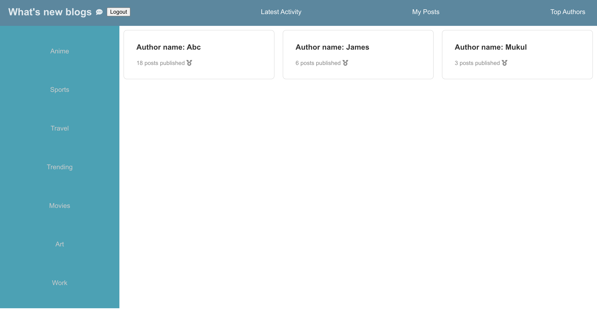
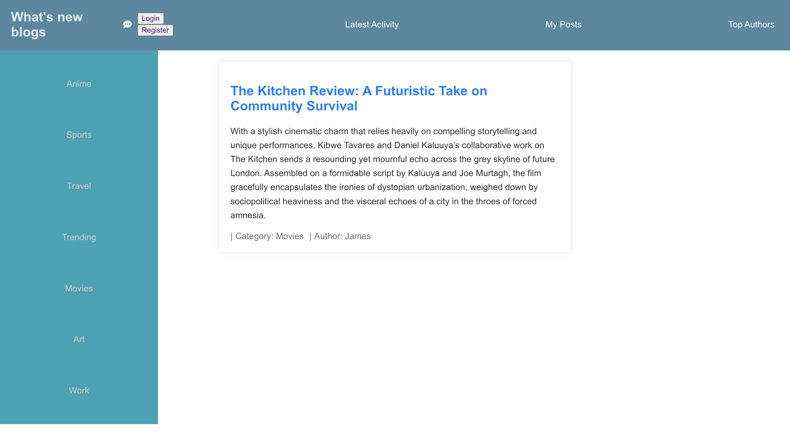

# Blogs

1. Users have the option to browse through all published posts from every user on the homepage or the Latest Activity tab.
2. To view, edit, or delete posts, users can simply click on the My Posts tab; please note that logging in is a prerequisite.
3. The Top Authors tab page displays the post count of the most prolific authors.
4. The sidebar features a list of top categories, organized by the number of associated posts. Categories will only be visible if there are posts within that specific category.




### Techstack

- Node.js, React
- Mongo

### Steps to run on local

Build and run your Docker image from root dir. Use --build to re-build changes.

```
docker-compose up
docker-compose up --build
```

Enter localhost:3000 in browser to access blog page.

For backend API, please refer to postman collection in root directory.

#### Dev debugging for docker

```
docker run -it blogs /bin/sh
```

#### To run single service 

To run backend only, go to ./api dir and run or comment out front-end from docker-compose.

```
docker build -t api . 
docker run --name api_c -p 4000:4000 --rm api
```
